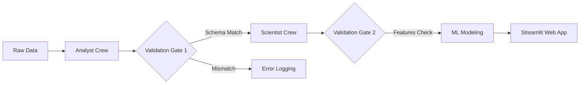

# AI Product Workflow: Customer Segmentation
## Online Retail II Dataset
### Industry-Simulated AI Product Workflow
**Author:** AI Assistant
**Date:** March 2026

---

# 1. Dataset Overview

- **Source:** Kaggle (Online Retail II UCI)
- **Domain:** E-commerce / Retail Transactions
- **Rows (Cleaned):** 779,425
- **Period:** Dec 2009 - Dec 2011
- **Key Features:** InvoiceDate, StockCode, Description, Quantity, Price, Customer ID, Country

---

# 2. Architecture Diagram

*Flow Orchestration:* CrewAI manages the handoff between Data Analysts and Data Scientists.

---

# 3. Analyst Crew — EDA Highlights (1/2)

**UK Market Dominance & Seasonality**
- **Spatial Concentration:** The UK accounts for 82.8% of total revenue (£14.3M). The rest of the 40 international markets account for only 17.2%.
- **Seasonality:** Pronounced Q4 uplift (2.6x peak in Nov 2010 vs lowest month) driven by holiday purchases. A strong need for inventory forecasting exists.

---

# 4. Analyst Crew — Key Findings (2/2)

**Customer & Product Dependencies**
- **Top Product:** "REGENCY CAKESTAND 3 TIER" is the highest earner. Heavy reliance on top SKUs.
- **Top Customers:** The top customer alone spent £580k+. Losing just a few top accounts would materially harm revenue.
- **AOV:** Average order value is £470 (median 6 units per line), indicating significant room for basket-building promotions.

---

# 5. Scientist Crew — Feature Engineering

**RFM & More:**
Using the cleaned transactional data, we engineered features for each of the 5,878 customers:
- **Recency:** Days since last purchase.
- **Frequency:** Total purchases over the period.
- **Monetary:** Total spent.
- **AvgOrderValue:** Average spend per order.
- **UniqueProducts:** Distinct SKUs purchased.

*All features were scaled using StandardScaler prior to modeling.*

---

# 6. Scientist Crew — Models & Metrics

**Clustering Comparison (n_clusters = 4):**
- **KMeans (Best Model):**
  - Silhouette Score: **0.4383**
  - Inertia: **12,576.99**
- **Agglomerative Clustering:**
  - Silhouette Score: **0.4183**

**Cluster Breakdown (KMeans):**
- **Cluster 0 (n=3734):** Standard/average customers.
- **Cluster 1 (n=14):** Highest frequency & spend (VIPs).
- **Cluster 2 (n=2129):** Sleepy / Churned (high recency, low freq).
- **Cluster 3 (n=1):** Outlier / Special wholesale account.

---

# 7. Model Card Summary

### Intended Use
- **Purpose:** Segment customers to enable targeted marketing strategies.
- **Out of Scope:** Predicting individual spending or usage outside segmentation.

### Limitations & Ethics
- **Limitations:** KMeans requires a predetermined number of clusters. Some clusters are extremely small (e.g., n=1, n=14).
- **Ethics:** Potential biases from historical inequities in training data. Must avoid exclusionary practices when targeting.

---

# 8. Web App Demo (Streamlit)

*Insert App Screenshots Here*
- **Home:** Run Flow Button
- **EDA Report:** Inline generated HTML profiling
- **Predict:** Customer input form
- **Downloads:** Artifacts (insights, model card, features.csv, model.pkl)

---

# 9. Challenges & Lessons Learned

- **Challenge:** Managing dependencies between multiple autonomous AI agents using CrewAI.
- **Challenge:** Ensuring deterministic outputs for machine learning steps.
- **Lesson:** Strict validation gates (JSON contracts) are absolutely essential to prevent downstream agent hallucinations or schema mismatches from breaking the flow.

---

# 10. Future Improvements

- **Deploy:** Host the Streamlit app on Streamlit Community Cloud or Railway.
- **Cloud Infrastructure:** Move data ingestion to an AWS S3 bucket instead of local CSVs.
- **Agent Capabilities:** Add an agent specifically for writing unit tests of the generated model code.
- **Predictive ML:** Add a classification model to predict Customer Churn instead of just Unsupervised Clustering.

---

# Thank You!

**Questions?**
*Check out the repo on GitHub for the source code, reports, and full documentation.*
